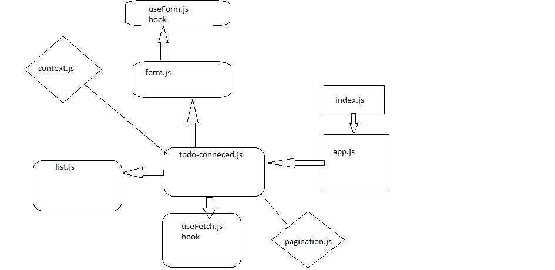

# lab-name: ToDo App

### Author: Yousef AlShun

### Links and Resources

#### Submission Request
- [submission PR](https://github.com/yousef-401-advanced-javascript/todo/pull/4)
- [GitHub actions](https://github.com/yousef-401-advanced-javascript/todo/actions)
- [GitHub deploy](https://yousef-401-advanced-javascript.github.io/todo/)
- [Netlify deploy](https://github.com/yousef-401-advanced-javascript/todo/pull/4)

#### Resources
- React Bootstrap

### Documentation
- [React Hello World](https://reactjs.org/docs/hello-world.html)
- [SASS](https://sass-lang.com/documentation)
- [Bootstrap](https://react-bootstrap.github.io/getting-started/introduction/)

### Setup
- install the packages by writing the command npm i (will install locally)
- start the app by writing npm start

### How to use the App
- fill the form with your task and submit
- you can check you task that you already did it 
- you can delete the tasks 
- you can hide the done tasks 

### UML

